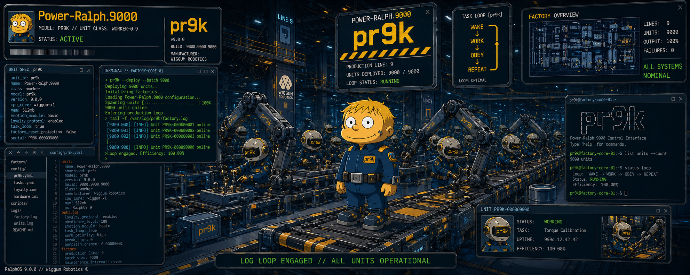
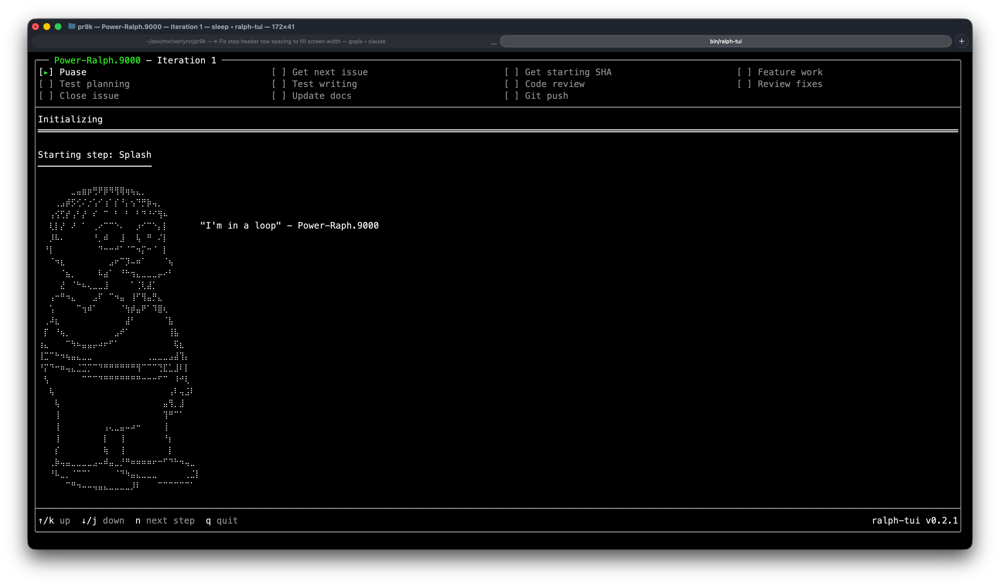

# PR9K: Power-Ralph.9000



**pr9k (Power-Ralph.9000)** is an automated development workflow orchestrator that drives the `claude` CLI through multi-step coding loops. It picks up GitHub issues labeled "ralph", implements features, writes tests, runs code reviews, and pushes — all unattended.

Based on [AI Hero's Getting Started with Ralph](https://www.aihero.dev/getting-started-with-ralph).



## Getting Started

### Prerequisites

- [Go 1.26.2](https://go.dev/dl/) (for pr9k)
- [GitHub CLI (`gh`)](https://cli.github.com/) — authenticated with access to your target repo
- [Claude CLI (`claude`)](https://docs.anthropic.com/en/docs/claude-cli) — installed and authenticated
- A GitHub repo with issues labeled `ralph` assigned to your user

### Installation

```bash
git clone https://github.com/mxriverlynn/pr9k.git
cd pr9k

# Build the orchestrator
make build
```

### Quick Start

From the **target repo** (the repo where you want Ralph to work):

```bash
# Run until no issues remain (until-done mode)
path/to/pr9k/bin/pr9k

# Or cap at 3 iterations
path/to/pr9k/bin/pr9k -n 3
```

Ralph will find the next open issue labeled `ralph`, implement the feature, write tests, run a code review, fix review findings, close the issue, update docs, and push — then repeat for the next issue. When run without `-n`, Ralph keeps going until `get_next_issue` finds no more issues.

## How To

### Run the orchestrator

```bash
# From your target repo — run until no issues remain:
path/to/pr9k/bin/pr9k

# Cap at N iterations:
path/to/pr9k/bin/pr9k -n <iterations>

# Specify the project directory explicitly:
path/to/pr9k/bin/pr9k --project-dir path/to/your-target-repo

# Build and run directly (without make):
cd path/to/pr9k/src && go build -o ../bin/pr9k ./cmd/pr9k
path/to/pr9k/bin/pr9k -n <iterations>
```

Omitting `-n` (or passing `-n 0`) runs Ralph in until-done mode: it keeps picking up issues until `get_next_issue` finds none. Passing `-n N` caps the run at N iterations.

Use `go build` — `go run` won't work because the project directory is resolved from the executable path.

### Keyboard controls (TUI)

During a run:
- **↑/k** / **↓/j** — scroll the log panel
- **n** — skip the current step (SIGTERMs the subprocess)
- **q** → **y** — quit Ralph (or **n** / **Esc** to cancel the quit)

When a step fails:
- **c** — continue to the next step
- **r** — retry the failed step
- **q** → **y** — quit Ralph

When the workflow completes:
- any key — exit

See [Recovering from Step Failures](docs/how-to/recovering-from-step-failures.md) and [Quitting Gracefully](docs/how-to/quitting-gracefully.md) for the full interaction model.

## Documentation

- [Architecture Overview](docs/architecture.md) — System-level architecture with block diagrams, data flow, and package dependencies
- **How-To Guides** (in [`docs/how-to/`](docs/how-to/)) — problem-focused guides for using pr9k on your own projects:
  - [Getting Started](docs/how-to/getting-started.md) — Install, first run against your own repo, quick tour of the TUI
  - [Setting Up Docker Sandbox](docs/how-to/setting-up-docker-sandbox.md) — Install Docker, run `sandbox create`, authenticate via `sandbox login`, and configure `CLAUDE_CONFIG_DIR`
  - [Reading the TUI](docs/how-to/reading-the-tui.md) — The four regions of the screen: header, checkbox grid, log panel, footer
  - [Building Custom Workflows](docs/how-to/building-custom-workflows.md) — Creating custom step sequences and prompt files
  - [Variable Output & Injection](docs/how-to/variable-output-and-injection.md) — How `{{VAR}}` tokens are resolved and how steps pass data via files
  - [Capturing Step Output](docs/how-to/capturing-step-output.md) — Using `captureAs` to bind step stdout to a variable
  - [Breaking Out of the Loop](docs/how-to/breaking-out-of-the-loop.md) — Using `breakLoopIfEmpty` to exit the iteration loop dynamically
  - [Configuring a Status Line](docs/how-to/configuring-a-status-line.md) — Add a `statusLine` block, use the sample script, tune `refreshIntervalSeconds`
  - [Recovering from Step Failures](docs/how-to/recovering-from-step-failures.md) — Error mode decisions: continue, retry, or quit
  - [Quitting Gracefully](docs/how-to/quitting-gracefully.md) — The `q`/`y` flow, Escape cancel, SIGINT, exit codes
  - [Passing Environment Variables](docs/how-to/passing-environment-variables.md) — Forwarding host env vars into the Docker sandbox via the `env` field
  - [Copying Log Text](docs/how-to/copying-log-text.md) — Mouse drag, keyboard selection, OSC 52 SSH fallback, and terminal native-selection override
  - [Debugging a Run](docs/how-to/debugging-a-run.md) — Reading the log file, finding captures, reproducing failures
- **Feature Documentation** (in [`docs/features/`](docs/features/)) — user-facing behavior and cross-package integration:
  - [CLI & Configuration](docs/features/cli-configuration.md) — Argument parsing and project/workflow directory resolution
  - [Subprocess Execution & Streaming](docs/features/subprocess-execution.md) — Real-time subprocess output streaming
  - [Workflow Orchestration](docs/features/workflow-orchestration.md) — Iteration loop, phase banners, capture logs, completion summary
  - [TUI Status Header & Log Display](docs/features/tui-display.md) — Checkbox grid plus phase/step banner rhythm and text selection
  - [Keyboard Input & Error Recovery](docs/features/keyboard-input.md) — Eight-mode keyboard state machine
  - [Signal Handling & Shutdown](docs/features/signal-handling.md) — Clean shutdown on SIGINT/SIGTERM, unified with quit-confirm
  - [Status Line](docs/features/status-line.md) — Custom status-line script contract, refresh triggers, and help modal
  - [Docker Sandbox](docs/features/docker-sandbox.md) — Mount layout, env allowlist, UID/GID mapping, cidfile lifecycle
  - [Sandbox Subcommand](docs/features/sandbox-subcommand.md) — `sandbox create` / `sandbox login` UX
- **Code Package Documentation** (in [`docs/code-packages/`](docs/code-packages/)) — per-Go-package API references for contributors:
  - [`internal/steps`](docs/code-packages/steps.md) — JSON step configs and prompt construction
  - [`internal/logger`](docs/code-packages/logger.md) — Timestamped, context-prefixed log file output
  - [`internal/vars`](docs/code-packages/vars.md) — VarTable scopes and phase transitions
  - [`internal/validator`](docs/code-packages/validator.md) — D13 validator: schema, scopes, referenced-file existence
  - [`internal/statusline`](docs/code-packages/statusline.md) — Runner lifecycle, State, BuildPayload, Sanitize
  - [`internal/sandbox`](docs/code-packages/sandbox.md) — BuildRunArgs, cidfile lifecycle, NewTerminator
  - [`internal/preflight`](docs/code-packages/preflight.md) — Prober, CheckDocker, CheckProfileDir, Run
  - [`internal/claudestream`](docs/code-packages/claudestream.md) — Parser, Renderer, Aggregator, RawWriter, Pipeline
- [Coding Standards](docs/coding-standards/) — Go error handling, testing, concurrency, API design, and Go-specific patterns
- [Architectural Decision Records (ADRs)](docs/adr/) — Historical decisions including the narrow-reading principle and cobra CLI choice
- [pr9k Plan](docs/plans/ralph-tui.md) — Original specification and design decisions

## Copyright & License

Copyright River Bailey. Licensed under the Apache License 2.0. See [LICENSE](./LICENSE) for details.
